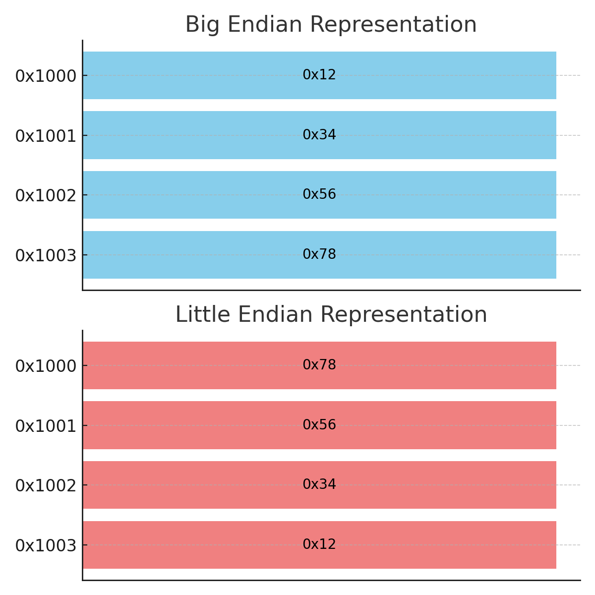

# Big and Little Endian - Basic Notes

## What is Endianness?

**Endianness** refers to the order in which bytes are stored in memory for multi-byte data types (e.g., integers, floating points).

There are two main types of endianness:

- **Big Endian** - The **most significant byte (MSB)** is stored first (at the lowest memory address).
- **Little Endian** - The **least significant byte (LSB)** is stored first (at the lowest memory address).

---

## Example: Storing the Hex Value `0x12345678`



| Address | Big Endian (MSB First) | Little Endian (LSB First) |
| ------- | ---------------------- | ------------------------- |
| 0x1000  | 0x12                   | 0x78                      |
| 0x1001  | 0x34                   | 0x56                      |
| 0x1002  | 0x56                   | 0x34                      |
| 0x1003  | 0x78                   | 0x12                      |

- In **Big Endian**, the most significant byte (`0x12`) is stored first.
- In **Little Endian**, the least significant byte (`0x78`) is stored first.

### Why is `0x12` the Most Significant Byte?

The hexadecimal number `0x12345678` is a **32-bit integer (4 bytes)**. The leftmost byte is the most significant because it contributes the most to the overall value due to **positional notation**:

- The further left a byte is, the higher its positional weight.
- The leftmost byte (`0x12`) is multiplied by the highest power of 16, while the rightmost byte (`0x78`) is multiplied by the lowest power of 16.

**Breaking Down `0x12345678` (From Left to Right):**

| Byte | Hex Value | Decimal Equivalent | Power of 16 | Contribution to Value |
| --- | --- | --- | --- | --- |
| Byte 1 | `0x12` | `18` | \(16^6\) | \(18 imes 16^6 = 301989888\) |
| Byte 2 | `0x34` | `52` | \(16^4\) | \(52 imes 16^4 = 851968\) |
| Byte 3 | `0x56` | `86` | \(16^2\) | \(86 imes 16^2 = 22016\) |
| Byte 4 | `0x78` | `120` | \(16^0\) | \(120 imes 16^0 = 120\) |

- The total value is calculated as: **301989888 + 851968 + 22016 + 120 = 302863992**.
- This explains why the **leftmost byte** is the most significant.

---

## Why Does Endianness Matter?

- It affects how data is read from and written to memory.
- Systems with different endianness need **conversion mechanisms** when communicating.
- Commonly seen in **network protocols (big endian)** vs. **x86 processors (little endian)**.

---

## Checking Endianness in C

```c
#include <stdio.h>

int main() {
    unsigned int x = 1;
    char *c = (char*)&x;
    if (*c)
        printf("Little Endian\n");
    else
        printf("Big Endian\n");
    return 0;
}
```

This program works by checking the **first byte** of the integer `x`:

- If it's `1`, the system is **Little Endian**.
- If it's `0`, the system is **Big Endian**.

> Note: This will not work if the value stored is 0 as it is represented in bytes the same for both big and little.
