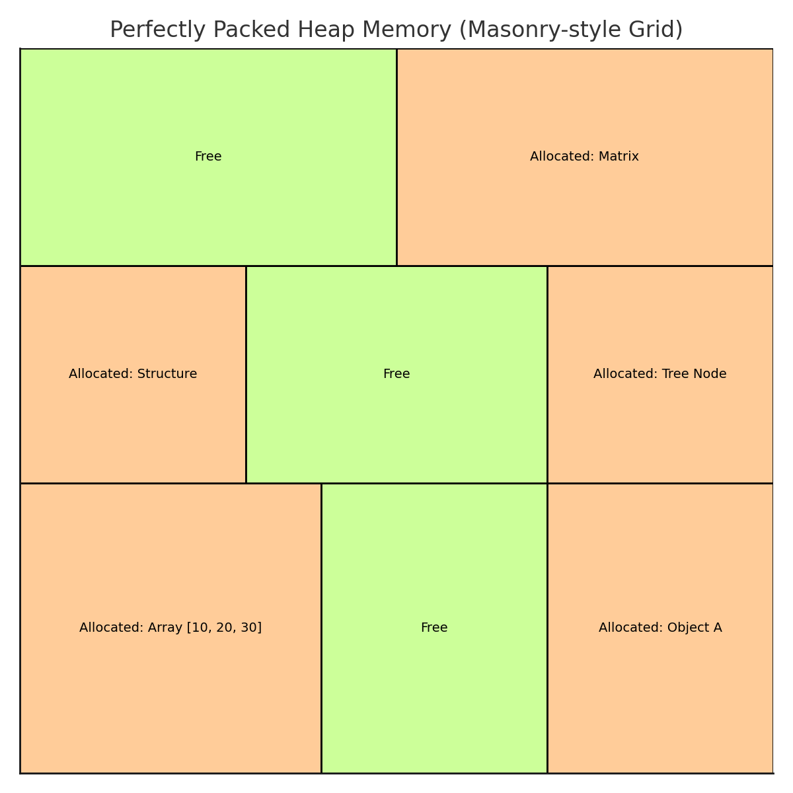

# Heap Tutorial for Beginners

## What is the Heap?

The **Heap** is a region of memory used for **dynamic memory allocation**, where memory size is not known at compile-time. Unlike the stack, the Heap allows memory to be allocated and freed **manually** by the programmer.

> **Note:** The Heap is part of the program's data segment but is managed separately from the stack. It allows the allocation of memory blocks of varying sizes, making it essential for dynamic data structures.

### Characteristics of the Heap:

- Memory is allocated using functions like `malloc()`, `calloc()`, `realloc()` (in C) or `new` (in C++).
- Memory is freed using `free()` (in C) or `delete` (in C++).
- The Heap **grows upward** from low memory addresses to high memory addresses.
- Memory allocation on the Heap is **slower** than the stack but allows much larger blocks of memory.
- The Heap is prone to memory leaks if memory is not properly freed.

> **Note:** The Heap is commonly used for data structures like linked lists, trees, graphs, and arrays of unknown size.

---

## How the OS Manages the Heap

When a program is loaded into memory, the Operating System allocates a region of memory for the Heap.

### Heap Allocation:

- The Heap starts at a fixed memory address and grows **upwards** as memory is allocated.
- The OS may **expand or shrink the Heap** as needed using system calls like `sbrk()` or `mmap()`.
- Memory allocated from the Heap persists until it is **explicitly freed by the programmer**.
- If memory is not freed, it leads to **memory leaks**, which can cause the program to consume more memory over time.

**Example**

| Memory Address Range | High / Low Address | Segment | Description |
| --- | --- | --- | --- |
| 32767 - 30000 | High Address | **Stack** | Local variables, function calls (Grows Downward) |
| 29999 - 20000 | Mid Address | **Heap** | Dynamically allocated memory (Grows Upward) |
| 19999 - 10000 | Low Address | **Data** | Global and static variables |
| 9999 | Lowest Address | **Text** | Program code (Instructions) |

- The **Stack** and **Heap** grow towards each other. If they collide, a memory error can occur.
- Unlike the stack, the **Heap requires manual memory management**.

---

## Allocation, Deallocation, and Reuse



- **Orange blocks** represent allocated memory (e.g., Arrays, Objects, Structures).
- **Green blocks** represent free memory available for allocation.
- The example shows an **Array `[10, 20, 30]`** stored within one of the allocated blocks.
- This visualisation highlights how **fragmentation** can occur if free memory blocks are scattered throughout the Heap.

### Memory Address Growth

- The **Heap grows upward** from lower memory addresses to higher memory addresses.
- New allocations are added to the top of the Heap.
- Memory can be freed, allowing that portion to be reused later.
- **Fragmentation:** Over time, as memory is allocated and freed, free memory blocks can become scattered. This makes it difficult to allocate large contiguous blocks, even if enough memory exists in total.

Let's consider this program:

```c
#include <stdio.h>
#include <stdlib.h>

int main() {
    int *arr = (int*) malloc(5 * sizeof(int));  // Allocating memory on the Heap

    if (arr == NULL) {
        printf("Memory allocation failed!\n");
        return 1;
    }

    for (int i = 0; i < 5; i++) {
        arr[i] = i * 10;
        printf("arr[%d] = %d\n", i, arr[i]);
    }

    free(arr);  // Freeing the memory
    return 0;
}
```

- Memory for the array is allocated **dynamically** using `malloc()`.
- The memory persists until it is explicitly freed using `free()`.
- If `free()` is not called, this would cause a **memory leak**.

---

## Differences Between Stack and Heap

| Aspect | Stack | Heap |
| --- | --- | --- |
| Growth Direction | Downward | Upward |
| Allocation Speed | Fast | Slower |
| Memory Management | Automatic (handled by the OS) | Manual (using `malloc()`, `free()`) |
| Memory Lifetime | Limited to function scope | Persistent until freed |
| Common Use Cases | Local variables, function calls | Dynamically sized structures (e.g., arrays, linked lists) |
| Fragmentation Risk | None (Automatic Management) | High (Manual Management, scattered free blocks) |
