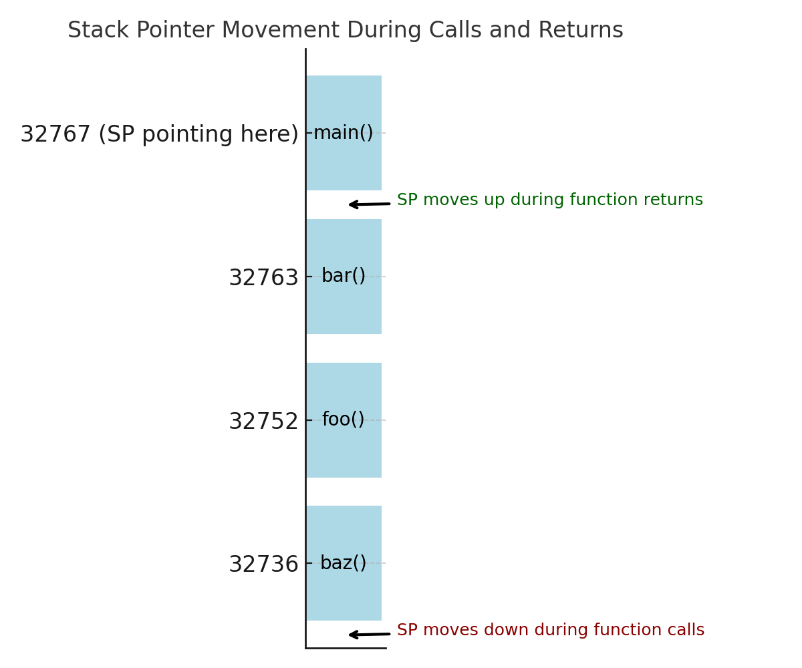
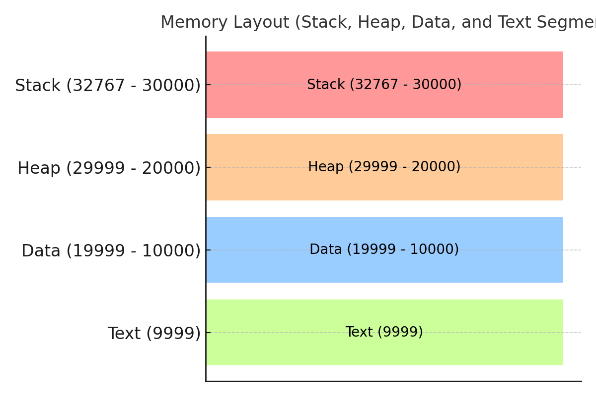
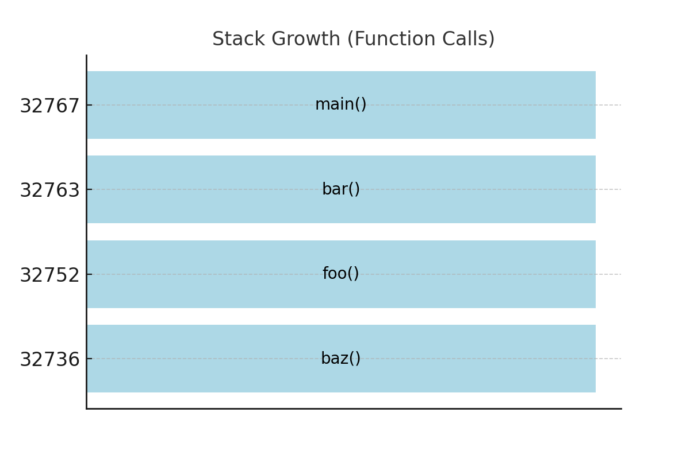
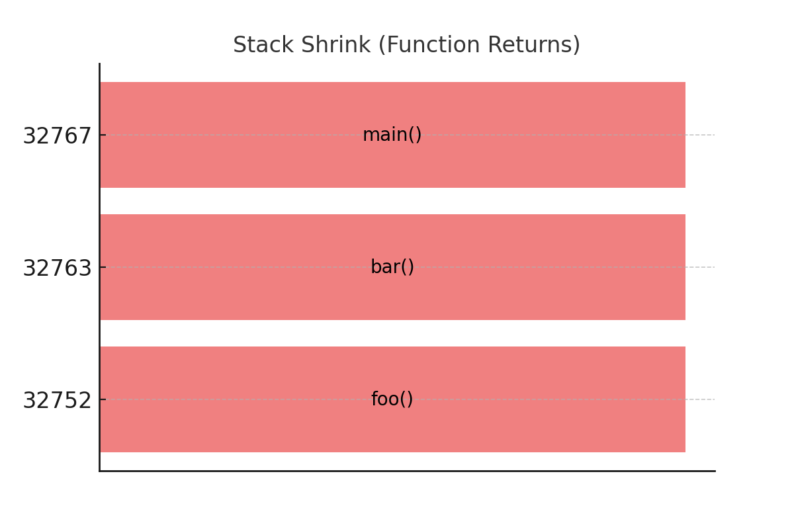

# Stack Tutorial for Beginners

## Summary

- The call stack grows downward from high to low memory addresses.
- The **most recent function call** is always at the lowest address (bottom of the table).
- Frames are removed in **reverse order** of how they were added (Last In, First Out - LIFO).
- The OS assigns a dedicated memory region for the stack, which can result in a **stack overflow** if exceeded.

---

## What is a Call Stack?

A **call stack** is a special region of memory that stores information about the active functions in a program.

- The stack **grows downward** from high memory addresses to low memory addresses.
- When a function is called, a new **stack frame** is created and pushed onto the stack.
- When a function returns, its stack frame is removed (popped) from the stack.

> **Note:** The stack is only used for storing functions and variables where the size is already known at compile-time. Dynamically allocated memory (such as memory created with `malloc()` in C) is stored on the **Heap**, not the stack.

---

## Stack Pointer

The **Stack Pointer (SP)** is a special register that keeps track of the **top of the stack**. It always points to the **start of the most recent stack frame**, which is the **lowest memory address of that frame**. This is because the stack grows **downward** in memory.

### Why It Points to the Start of the Frame:

- Memory grows downward from high addresses to low addresses.
- When a new function is called, the **SP is moved downward to the lowest available address**.
- The start of the stack frame is the lowest memory address within that frame, making it the **first address to be written to when a function is called**.
- The Stack Pointer makes it easy to **allocate and free memory** by simply moving up or down.

The **Stack Pointer (SP)** is a special register that keeps track of the **top of the stack**. It always points to the **start of the most recent stack frame**, which is the **lowest memory address of that frame**.

### How the Stack Pointer Works:

- When a new function is called, the **Stack Pointer** is **decremented** (moved to a lower memory address) to allocate space for the new stack frame.
- When a function returns, the **Stack Pointer** is **incremented** (moved to a higher memory address) to free the space occupied by the frame.
- This ensures the stack grows and shrinks dynamically as functions are called and returned.

**Example**:



- The **SP moves downward** as new function calls are made.
- The **SP moves upward** as functions return.
- This mechanism ensures the stack dynamically grows and shrinks as needed.

If the stack starts at memory address `32767` and a function is called, the **Stack Pointer** moves down to, say, `32763`. When that function returns, the **Stack Pointer** moves back up to `32767`.

---

## How the OS Assigns Memory for the Stack

When a program is loaded into memory by the Operating System (OS), the OS assigns specific regions of memory to different parts of the program. These include:

- **Text Segment**: Where the compiled code (instructions) resides.
- **Data Segment**: Where global and static variables are stored.
- **Heap**: Used for dynamic memory allocation (e.g., `malloc()` in C).
- **Stack**: Used for managing function calls and local variables.

---

### Stack Allocation

- The OS allocates a **fixed-size region of memory** for the stack when the program starts.
- The size of this region is usually determined by system settings or compiler options (e.g., 8 MB on Linux by default).
- The top of the stack is initialised to a high memory address and grows **downwards** as functions are called.
- If the stack grows beyond the allocated memory region, a **stack overflow** error occurs.

### Memory Layout Example (Including High and Low Addresses)

| Memory Address Range | High / Low Address | Segment | Description |
| --- | --- | --- | --- |
| 32767 - 30000 | High Address | **Stack** | Local variables, function calls (Grows Downward) |
| 29999 - 20000 | Mid Address | **Heap** | Dynamically allocated memory (Grows Upward) |
| 19999 - 10000 | Low Address | **Data** | Global and static variables |
| 9999 | Lowest Address | **Text** | Program code (Instructions) |

- The **Stack** and **Heap** grow towards each other. If they collide, a memory error can occur.
- The **Text** segment is read-only, while the **Data**, **Heap**, and **Stack** segments are writable.

**Example**



- The **Stack** grows downward from high addresses (32767).
- The **Heap** grows upward from mid-range addresses (20000 - 29999).
- The **Data** segment stores global/static variables (10000 - 19999).
- The **Text** segment holds the compiled code (instructions) at the lowest address (9999).

---

## How the Stack Grows (Function Calls and Return Addresses)



- Functions are called in order: `main()` ➔ `bar()` ➔ `foo()` ➔ `baz()`.
- Each call adds a new frame to the stack, with its **Return Address**.
- The **lowest address** contains the most recently called function.

Let's consider this simple program:

```c
#include <stdio.h>

void baz() {
    int w = 199;
    printf("In baz: %d\n", w);
}

void foo() {
    int v = 198;
    baz();
}

void bar() {
    int x = 99;
    foo();
}

int main() {
    bar();
    return 0;
}
```

### When the program runs, the stack looks like this (including Return Addresses):

| Address | Function Call | Variables |
| ------- | ------------- | --------- |
| 32767   | `main()`      | None      |
| 32763   | `bar()`       | `x = 99`  |
| 32752   | `foo()`       | `v = 198` |
| 32736   | `baz()`       | `w = 199` |

**Explanation**:

- When a function is called, a **Return Address** is also pushed onto the stack.
- This **Return Address** is the memory location to which the program will return once the function finishes executing.
- The stack grows downward with each function call, and each new stack frame contains:
  - The **Return Address**
  - Argument variables passed too the function
  - Local variables declared within the function
- The most recent function call is always at the lowest address (bottom of the table).

### Example of Return Addresses:

| Address | Function Call | Variables | Return Address      |
| ------- | ------------- | --------- | ------------------- |
| 32767   | `main()`      | None      | OS Return Address   |
| 32763   | `bar()`       | `x = 99`  | Address of `main()` |
| 32752   | `foo()`       | `v = 198` | Address of `bar()`  |
| 32736   | `baz()`       | `w = 199` | Address of `foo()`  |

- The **Return Address** is what allows the program to return to the correct location when a function finishes executing.
- The **highest memory address (`32767`)** is at the top (i.e., `main()`).
- The stack grows downward with each function call.
- `baz()` (the last function called) is at the **lowest address (`32736`)**.

---

## How the Stack Shrinks (Function Returns and Return Addresses)



- Functions return in reverse order: `baz()` ➔ `foo()` ➔ `bar()` ➔ `main()`.
- Frames are removed from the **bottom of the memory range**, where the most recent calls are.
- This follows the **Last In, First Out (LIFO)** principle.
- When `baz()` finishes execution, it is popped off the stack.
- Then `foo()` is popped after completing its work.
- Followed by `bar()`.
- Finally, `main()` returns to the OS, emptying the stack.
